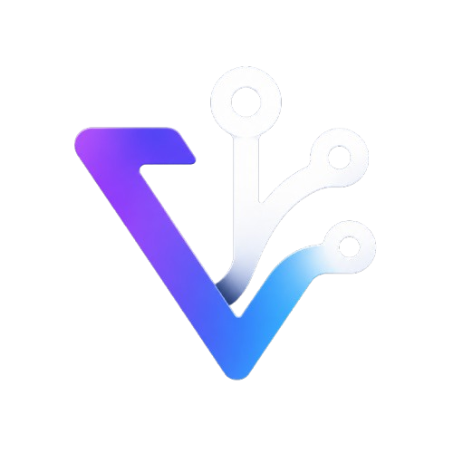
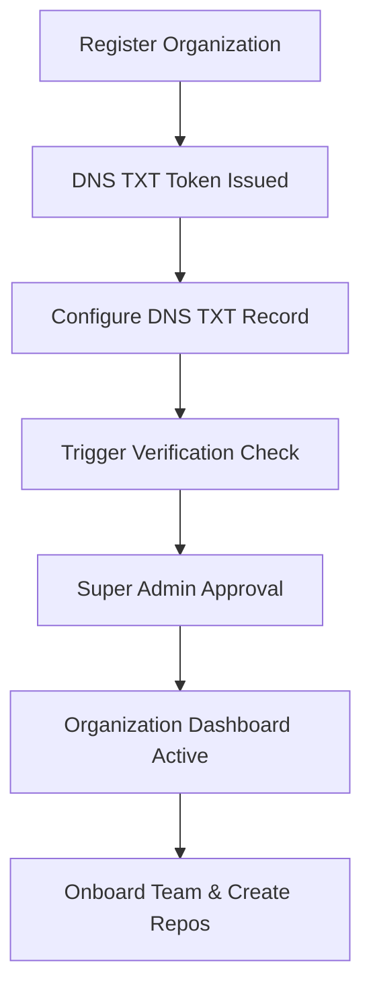

# GitVexo: Secure Enterprise Git & Collaboration Platform

<!-- SEO METADATA (For Search Crawlers & Public Repositories)
Title: GitVexo - Secure Self-Hosted Git Hosting & Enterprise Collaboration Platform
Description: GitVexo is a high-security, multi-tenant GitHub/GitLab alternative featuring advanced search, multi-factor security, real-time notifications, and a secure sandboxed Desktop application with clipboard lock and screenshot prevention.
Keywords: git hosting, self-hosted github clone, multi-tenant saas git, dns verification txt records, secure git clone desktop, isomorphic-git, enterprise git repository management, file locking branch protection
-->

<div align="center">
  
  <h1>GitVexo Hub</h1>
  <p><strong>The Secure, Multi-Tenant Git Hosting & Collaboration Platform for Enterprises</strong></p>
  <p><i>A premium, auditable alternative to GitHub and GitLab built to protect intellectual property in private custody.</i></p>
</div>

---

## 📖 Introduction & Platform Vision

**GitVexo** is a comprehensive, next-generation Git repository hosting and developer collaboration platform. Built with strict **multi-tenant SaaS isolation** and **enterprise-grade data custody**, it provides teams with complete control over their source code, pipelines, and wiki documentation.

Unlike traditional platforms, GitVexo is designed with **zero-leak intellectual property enforcement**. By coupling a powerful web hub with a custom **secure sandboxed desktop client**, GitVexo gives project administrators the tools to prevent screenshot leaks, restrict clipboard copying, and enforce domain governance through cryptographic DNS verification.

---

## 🌟 Key Platform Features

### 🏢 Multi-Tenant Organization Hub
- **Enterprise Separation**: Custom company subdomains (`company.gitvexo.magnytesolution.com`) isolate organization directories.
- **DNS Domain Verification**: Cryptographic domain ownership proof using custom DNS TXT records.
- **System Admin Approval**: A multi-step onboarding audit ensures only authorized enterprise domains can activate.

### 📁 Repository & File Management
- **Universal Git Engine**: High-performance Git repository management powered by server-side isomorphic-git.
- **Browser-Based IDE (CRUD)**: Create, browse, edit, and delete files inside the web UI, committing changes directly back to Git.
- **File Locking**: Prevent concurrent edit conflicts by securing exclusive locks on critical configuration files.
- **Branch Protection Rules**: Restrict pushes, mandate code reviews, and configure write access limits on default branches.

### 🔀 Code Review & Merge Requests
- **Visual Merge Requests**: Create pull requests, visualize line-by-line file diffs, and check for merge conflicts before integration.
- **Granular Code Reviews**: Post inline comments directly on specific lines of code, trigger approvals, or request structural changes.
- **Status Timeline**: Track code review progress, active discussions, commit additions, and pipeline statuses in a unified feed.

### 🐛 Issue Tracking & Project Management
- **Detailed Issue Desk**: Catalog bug reports, feature requests, and tasks with priority scales (Low to Critical) and status states (Open to Closed).
- **Interactive Discussions**: Support markdown comments, emoji reactions, and project-wide teammate notifications.
- **Scope Filtering**: Filter issues by labels, active assignees, priority, and date.

### 🔍 Advanced Search Engine
- **Full-Text Code Search**: Find specific functions, imports, and variables across your organization's entire codebase.
- **Regular Expression (Regex) Matching**: Run complex query patterns directly against active repository trees.
- **Filter Scoping**: Narrow down searches by file extension, repository, programming language, or git commit history.

### 🔔 Real-Time Notifications Center
- **Immediate Alerts**: Never miss merge request reviews, issue mentions, pipeline failures, or system updates.
- **Notification Center**: A centralized inbox with mark-as-read toggles, category filtering (All/Unread), and instant unread count badges.

### 🛡️ Secure Desktop Application (IP Shield)
- **Sandboxed Workspace**: Restrict source code checkouts to an app-controlled, encrypted directory (`secure-repos` within AppData).
- **Screenshot Protection**: Auto-block system screenshots (PrintScreen disabled) to prevent visual data leaks.
- **Clipboard & App Isolation**: Keep source code out of standard system clipboard caches and memory spaces.
- **Real-Time Sync**: Watch workspace changes and automatically sync local edits back to your organization’s server.

### ⚙️ CI/CD Pipelines
- **Automation Logs**: Monitor active build steps, capture complete standard output job logs, and retry failed operations.
- **Pipeline Controls**: Trigger runs manually or hook them directly into developer merge actions.

### 📚 Wiki & Documentation
- **Dynamic Wikis**: Establish a secure knowledge base with a tabbed side-by-side markdown editor and live preview engine.
- **Slug-Based Routing**: Clean, indexable documentation URLs for developer wiki pages.

### 📡 Developer Webhooks
- **Event Subscriptions**: Dispatch POST payloads to custom external endpoints when merge requests, issues, or pushes trigger.
- **Security Check**: Enforce SSL validation checks and cryptographically verify payloads using secret tokens.

---

## 👤 User Roles & Permission Matrix

GitVexo secures files and assets by maintaining strict Role-Based Access Control (RBAC).

| Permission / Action | Super Admin (System) | Project Admin (Tenant) | Developer | Viewer (Auditor) |
| :--- | :---: | :---: | :---: | :---: |
| **System-wide Configuration & Billing** | ✅ | ❌ | ❌ | ❌ |
| **Approve Registered Organizations** | ✅ | ❌ | ❌ | ❌ |
| **Verify Company Domain (DNS Check)** | ✅ | ✅ | ❌ | ❌ |
| **Create/Delete Repositories** | ✅ | ✅ | ❌ | ❌ |
| **Configure Branch Protection & Locks** | ✅ | ✅ | ❌ | ❌ |
| **Push Code & Merge Pull Requests** | ✅ | ✅ | ✅ | ❌ |
| **Submit Inline Code Reviews** | ✅ | ✅ | ✅ | ❌ |
| **Create Issues & Wiki Pages** | ✅ | ✅ | ✅ | ❌ |
| **Browse Code (Read-Only Clone)** | ✅ | ✅ | ✅ | ✅ |
| **View Audit Logs & IP Access Rules** | ✅ | ✅ | ❌ | ❌ |

---

## 🚀 The End-User Journey: Getting Started

As an end-user of GitVexo (Developer, Admin, or Manager), your experience begins with onboarding your organization, validating your identity, and configuring your secure workspace.



### Step 1: Register Your Organization
1. Navigate to the GitVexo signup page.
2. Enter your **Company Name** and your official corporate **Domain** (e.g., `company.com`).
3. Set up the Primary Administrative Owner profile with your corporate email and a secure password.
4. Complete the registration. The system will generate a unique cryptographic **DNS TXT verification token**.

### Step 2: Establish DNS Domain Ownership
To protect companies from unauthorized domain usage, your domain must be verified before full dashboard access is unlocked:
1. Log in to your domain registrar's DNS configuration portal (e.g., GoDaddy, Cloudflare, Namecheap).
2. Create a new **TXT Record** with the following details:
   - **Type**: `TXT`
   - **Host / Name**: `_gitvexo-verify`
   - **Content / Value**: `[Your Unique Cryptographic Verification Token]`
   - **TTL**: `3600` (or default 1 hour)
3. Return to the GitVexo **Domain Verification** page in your admin panel and click **Verify Ownership Now**.
4. Once verified, your status transitions to **Awaiting Admin Approval** where a system operator activates your dedicated tenant context.

### Step 3: Accessing Your Dashboard & Managing Repositories
Once active:
- Standard team members receive email invitations to register within the domain.
- Users sign in directly at their dedicated tenant dashboard.
- Admins can immediately navigate to **Create Repository**, choose visibility (Public/Private), and initialize files.

---

## 💻 Detailed End-User Guides

### 1. Daily Developer Code Workflow (Web IDE)
For rapid edits, hotfixes, or documentation updates, developers can edit repositories directly inside their browser:
1. Navigate to your repository dashboard and select a file.
2. View syntax-highlighted code complete with exact line numbering.
3. Click the **Edit** icon to open the inline Markdown/Code editor.
4. Modify the code, review changes, and input a descriptive **Commit Message** (e.g., `fix(auth): update refresh token timeout`).
5. Click **Commit Changes** to write the modifications directly to the repository branch.

---

### 2. The Collaborative Code Review (Merge Requests)
GitVexo provides a powerful, visual framework to ensure zero code is merged without passing peer scrutiny.

```
                  ┌──────────────────────┐
                  │ Create Merge Request │
                  └──────────┬───────────┘
                             ▼
                  ┌──────────────────────┐
                  │ CI/CD Pipeline Runs  │
                  └──────────┬───────────┘
                             ▼
                  ┌──────────────────────┐
                  │ Peer Inline Reviews  │
                  └──────────┬───────────┘
                             ▼
                  ┌──────────────────────┐
                  │ Approve / Fix Code   │
                  └──────────┬───────────┘
                             ▼
                  ┌──────────────────────┐
                  │    Merge Branch      │
                  └──────────────────────┘
```

1. **Initiate Request**: Select your source branch (e.g., `feature/login-ui`) and compare it with the target branch (e.g., `main`).
2. **Conflict Resolution**: GitVexo automatically parses the repository tree to declare if branches can be merged cleanly or if conflict intervention is necessary.
3. **Peer Review**: Assign developers to review. Reviewers browse files in the diff viewer, click on a line of code, and write inline suggestions.
4. **Approve & Merge**: Once pipelines pass and approval criteria are met, the Project Admin merges the branch, executing a clean git commit on the target line.

---

### 3. Issue Management & Wiki Hub
Keep your projects organized and documented in one central workspace:
- **Issues**: Create an issue, specify if it is a `bug`, `feature`, `task`, or `documentation`, set its urgency from `Low` to `Critical`, and assign it to a team member. You can filter open tasks directly from the search bar.
- **Wikis**: Create structured user manuals and software guides. Click **Wiki**, select **New Page**, write using clean Markdown syntax, and toggle the **Preview** tab to check formatting before saving. Pages are cataloged with version controls.

---

### 4. Advanced Search Dashboard
To query codebases without checking them out locally, use the **Advanced Search** center:
1. Click **Search** in the navigation header.
2. Enter your keyword or query (e.g., `jwt.verify`).
3. Toggle between the tabs:
   - **Code**: Matches the text directly inside source files.
   - **Files**: Finds specific file names across directories.
   - **Commits**: Searches commit log descriptions.
4. Apply filters:
   - **Language Filter**: Limit results to `.ts`, `.py`, `.go`, etc.
   - **Repository Filter**: Constrain the search to a single repository scope.
   - **Regex Search**: Enable regular expression matches (e.g., `/const\s+\w+\s*=/`).

---

### 5. GitVexo Desktop App: Secure Developer Workspace
For maximum code security, enterprise administrators may enforce **Secure Cloning**. This blocks traditional terminal-based `git clone` commands, routing all operations exclusively through the **GitVexo Desktop Application**.

> [!IMPORTANT]
> **Why GitVexo Desktop is Different:**
> Unlike standard desktop clients, GitVexo locks code down to protect corporate intellectual property. Files do not sit in unsecured download or document directories.

#### Enforced Security Features:
- **Sandbox Workspace**: Code repositories clone directly into a system-restricted secure directory:
  - 🖥️ **Windows**: `C:\Users\<username>\AppData\Roaming\GitVexo\secure-repos`
  - 🍎 **macOS**: `~/Library/Application Support/GitVexo/secure-repos`
  - 🐧 **Linux**: `~/.config/GitVexo/secure-repos`
- **Anti-Leak Shield**:
  - 🛡️ **PrintScreen Blocked**: Standard keyboard screenshot captures are disabled when the app window is focused.
  - 🛡️ **Clipboard Protection**: Prevents secure source code fragments from being pasted into unauthorized browser or external application inputs.
  - 🛡️ **Content Guard**: Implements native OS-level window display hiding during video calls or screen sharing.
- **Automatic Synchronizer**: Detects local file changes inside the secure workspace using background directory watchers and queues commits.

#### How to use:
1. Download and launch the **GitVexo Desktop Application**.
2. Sign in using your corporate organization credentials.
3. Select your designated repository from the dashboard list.
4. Click **Clone to Secure Workspace**.
5. Edit files locally. The desktop application tracks modifications and provides a secure, streamlined layout to push updates directly back to your branch.

---

## 🔒 Platform Security & Compliance Policies

GitVexo is architected to exceed standard industry compliance audits:
- **Complete Tenant Isolation**: Every registered corporate tenant operates inside a secure network block, preventing cross-tenant data leaks.
- **Token Governance**: Developers generate granular **Personal Access Tokens (PATs)** with precise expiry intervals and scoping constraints (e.g., read-only wiki, push code).
- **Audit Logging**: Organizations keep a searchable chronological **Audit Log** tracking all critical events (e.g., organization registrations, domain checks, repository deletions, member role updates).
- **IP Protection Rules**: Enforce IP address restrictions in the Admin Panel to prevent dashboard logins outside of verified corporate VPN networks.

---

## ❓ Frequently Asked Questions (FAQ)

### 🔹 Can I clone repositories using the standard command line?
If your organization enforces **Secure Cloning**, traditional command line clones (e.g., `git clone https://...`) will be blocked. You must use the **GitVexo Desktop App** to fetch files. This guarantees that source code is secured within the encrypted workspace sandbox.

### 🔹 What happens if my DNS TXT record is removed after verification?
Domain verification checks are run periodically. If the verification token is removed, your organization's administrators will receive an alert. If it remains unresolved, organization repositories may be temporarily suspended from public view until the DNS authority record is restored.

### 🔹 How do file locks work in a team environment?
A file lock prevents conflict. When a developer locks a file, other developers can still read the code, but they cannot commit edits to it online or push updates to that file on any branch. The lock remains active until the owner releases it or an authorized Project Admin override takes place.

### 🔹 Is there a limit on how many organizations I can manage?
A corporate user profile is linked directly to a specific enterprise domain context. While users can participate in multiple repositories under that single organization, cross-domain multi-tenancy access requires registering separate credential scopes.

### 🔹 Does the system support continuous integration out of the box?
Yes! Standard build states and job logging are built into the dashboard. You can inspect continuous integration logs, view the run histories of individual branches, and trigger manual build runs inside the **Pipelines** tab of any repository.

---

<div align="center">
  <p><strong>GitVexo Hub — Securing Developer Collaboration with Zero Compromises</strong></p>
  <p>© 2026 Magnyte Software Private Limited. All corporate guidelines and product terms apply.</p>
</div>
